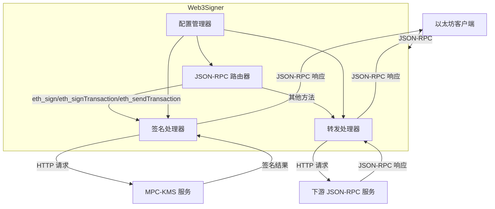

# web3signer-go 设计文档

## 概述

web3signer-go 是一个基于 MPC-KMS 的以太坊 JSON-RPC 签名服务。它提供有限的 ETH JSON-RPC 接口，并将不支持的接口转发到下游服务。

## 架构设计

### 系统架构图



### 组件职责

1. **配置管理器**：解析命令行参数，管理服务配置
2. **JSON-RPC 路由器**：根据方法名路由请求到相应处理器
3. **签名处理器**：处理 `eth_sign`、`eth_signTransaction`、`eth_sendTransaction` 方法
4. **转发处理器**：将不支持的 JSON-RPC 方法转发到下游服务
5. **MPC-KMS 客户端**：与 MPC-KMS 服务通信的 HTTP 客户端
6. **下游服务客户端**：与下游 JSON-RPC 服务通信的 HTTP 客户端

## 组件和接口

### 1. 配置管理器 (Config)

**职责**：
- 解析命令行参数
- 验证必需参数
- 提供配置访问接口

**接口设计**：
```go
type Config struct {
    HTTPHost           string
    HTTPPort           int
    KMSConfig          KMSConfig
    DownstreamConfig   DownstreamConfig
    LogLevel           string
}

type KMSConfig struct {
    Endpoint     string
    AccessKeyID  string
    SecretKey    string
    KeyID        string
}

type DownstreamConfig struct {
    Host string
    Port int
    Path string
}
```

### 2. JSON-RPC 路由器 (Router)

**职责**：
- 解析 JSON-RPC 请求（支持单个请求和批量请求）
- 根据方法名路由到相应处理器
- 组装 JSON-RPC 响应（保持请求顺序和ID）

**接口设计**：
```go
type Router interface {
    HandleRequest(rawRequest interface{}) (interface{}, error)
}

type JSONRPCRequest struct {
    JSONRPC string      `json:"jsonrpc"`
    Method  string      `json:"method"`
    Params  interface{} `json:"params"`
    ID      interface{} `json:"id"`
}

type JSONRPCResponse struct {
    JSONRPC string      `json:"jsonrpc"`
    Result  interface{} `json:"result,omitempty"`
    Error   *JSONRPCError `json:"error,omitempty"`
    ID      interface{} `json:"id"`
}

// 批量请求：JSONRPCRequest 数组
// 批量响应：JSONRPCResponse 数组（可以为空数组，如果所有请求都无效）
```

### 3. 签名处理器 (Signer)

**职责**：
- 处理 `eth_sign`、`eth_signTransaction`、`eth_sendTransaction` 方法
- 使用 ethgo 构建和序列化交易
- 调用 MPC-KMS 进行签名
- 处理签名结果

**接口设计**：
```go
type Signer interface {
    Sign(data []byte) ([]byte, error)
    SignTransaction(tx *ethgo.Transaction) (*ethgo.Transaction, error)
    SendTransaction(tx *ethgo.Transaction) (common.Hash, error)
}

// 实现 ethgo 的 Signer 接口
type MPCKMSSigner struct {
    client *KMSClient
    keyID  string
}

func (s *MPCKMSSigner) Sign(tx *ethgo.Transaction) ([]byte, error) {
    // 实现签名逻辑
}
```

### 4. MPC-KMS 客户端 (KMSClient)

**职责**：
- 实现 MPC-KMS HTTP 签名认证
- 发送签名请求到 MPC-KMS
- 处理 MPC-KMS 响应

**接口设计**：
```go
type KMSClient interface {
    Sign(keyID string, data []byte) ([]byte, error)
    SignWithSummary(keyID string, data []byte, summary *SignSummary) ([]byte, error)
}

type SignSummary struct {
    Type   string
    From   string
    To     string
    Amount string
    Token  string
    Remark string
}
```

### 5. 转发处理器 (Forwarder)

**职责**：
- 转发不支持的 JSON-RPC 方法到下游服务
- 保持请求 ID 不变
- 处理下游服务响应

**接口设计**：
```go
type Forwarder interface {
    Forward(req *JSONRPCRequest) (*JSONRPCResponse, error)
}
```

## 数据模型

### 1. 交易数据模型

使用 ethgo 的 Transaction 结构作为内部表示：

```go
// ethgo.Transaction 结构
type Transaction struct {
    Type                 TransactionType
    Hash                 Hash
    From                 Address
    To                   *Address
    Input                []byte
    GasPrice             uint64
    Gas                  uint64
    Value                *big.Int
    Nonce                uint64
    V, R, S              []byte
    ChainID              *big.Int
    AccessList           AccessList
    MaxPriorityFeePerGas *big.Int
    MaxFeePerGas         *big.Int
}
```

### 2. JSON-RPC 参数模型

```go
// eth_sign 参数
type EthSignParams []interface{} // [address, data]

// eth_signTransaction 参数
type EthSignTransactionParams struct {
    From     string `json:"from"`
    To       string `json:"to,omitempty"`
    Gas      string `json:"gas,omitempty"`
    GasPrice string `json:"gasPrice,omitempty"`
    Value    string `json:"value,omitempty"`
    Data     string `json:"data,omitempty"`
    Nonce    string `json:"nonce,omitempty"`
}

// eth_sendTransaction 参数
type EthSendTransactionParams struct {
    From                 string `json:"from"`
    To                   string `json:"to,omitempty"`
    Gas                  string `json:"gas,omitempty"`
    GasPrice             string `json:"gasPrice,omitempty"`
    Value                string `json:"value,omitempty"`
    Data                 string `json:"data,omitempty"`
    Nonce                string `json:"nonce,omitempty"`
    MaxPriorityFeePerGas string `json:"maxPriorityFeePerGas,omitempty"`
    MaxFeePerGas         string `json:"maxFeePerGas,omitempty"`
}
```

### 3. 批量请求处理模型

根据 JSON-RPC 2.0 规范，批量请求是一个请求对象数组：

```go
// 批量请求示例
[
    {
        "jsonrpc": "2.0",
        "method": "eth_sign",
        "params": ["0x...", "0x..."],
        "id": 1
    },
    {
        "jsonrpc": "2.0",
        "method": "eth_getBalance",
        "params": ["0x...", "latest"],
        "id": 2
    }
]

// 批量响应示例
[
    {
        "jsonrpc": "2.0",
        "result": "0x...",
        "id": 1
    },
    {
        "jsonrpc": "2.0",
        "result": "0x123...",
        "id": 2
    }
]

// 批量请求处理规则：
// 1. 空数组：返回空数组响应
// 2. 无效请求：返回单个错误响应（不是数组）
// 3. 部分有效：返回响应数组，无效请求返回错误响应
// 4. 顺序保持：响应顺序必须与请求顺序一致
// 5. 并发处理：可以并发处理批量中的请求以提高性能
```

## 错误处理

### 错误分类

1. **JSON-RPC 解析错误**：无效的 JSON-RPC 请求格式
2. **参数验证错误**：缺少必需参数或参数格式错误
3. **MPC-KMS 错误**：MPC-KMS 服务返回的错误
4. **下游服务错误**：下游 JSON-RPC 服务返回的错误
5. **网络错误**：连接超时、网络不可达等
6. **内部错误**：程序逻辑错误

### 错误处理策略

1. **JSON-RPC 规范错误**：返回符合 JSON-RPC 2.0 规范的错误响应
2. **MPC-KMS 错误透传**：将 MPC-KMS 的错误信息直接返回给客户端
3. **错误日志记录**：记录详细的错误信息到日志
4. **优雅降级**：网络错误时返回适当的错误信息，不崩溃

### 错误码映射

```go
const (
    // JSON-RPC 标准错误码
    ErrParseError     = -32700
    ErrInvalidRequest = -32600
    ErrMethodNotFound = -32601
    ErrInvalidParams  = -32602
    ErrInternalError  = -32603

    // 自定义错误码
    ErrKMSError       = -32000
    ErrDownstreamError = -32001
    ErrNetworkError   = -32002
)
```

## 测试策略

### 单元测试

1. **配置管理器测试**：
   - 命令行参数解析
   - 必需参数验证
   - 环境变量支持

2. **JSON-RPC 路由器测试**：
   - 请求路由逻辑
   - 方法分发
   - 错误处理

3. **签名处理器测试**：
   - 交易构建逻辑
   - 签名请求组装
   - 响应解析

4. **MPC-KMS 客户端测试**：
   - HTTP 签名认证
   - 请求构建
   - 错误处理

### 集成测试

1. **MPC-KMS 集成测试**：
   - 实际调用 MPC-KMS 服务
   - 签名流程验证
   - 错误场景测试

2. **下游服务集成测试**：
   - 转发功能验证
   - 响应透传测试
   - 错误处理测试

### 端到端测试

1. **完整流程测试**：
   - 启动 web3signer-go 服务
   - 发送 JSON-RPC 请求
   - 验证签名结果
   - 验证转发功能

### 测试工具

1. **Mock MPC-KMS 服务**：模拟 MPC-KMS 响应
2. **Mock 下游服务**：模拟下游 JSON-RPC 服务
3. **测试客户端**：发送测试请求的工具

## 安全考虑

### 1. 认证安全

- **MPC-KMS 认证**：实现正确的 HTTP 签名认证机制
- **密钥安全**：访问密钥通过命令行参数或环境变量传递，不在代码中硬编码
- **时间戳验证**：确保请求时间戳在有效范围内

### 2. 数据安全

- **输入验证**：验证所有输入参数，防止注入攻击
- **错误信息**：不泄露敏感信息到错误响应中
- **日志安全**：不在日志中记录敏感数据（如密钥、签名数据）

### 3. 网络安全

- **超时设置**：为所有外部 HTTP 调用设置合理的超时
- **连接池**：使用连接池管理 HTTP 连接
- **TLS 支持**：支持 HTTPS 连接（如果 MPC-KMS 或下游服务使用）

## 部署和运维

### 1. 构建和打包

```bash
# 构建二进制文件
go build -o web3signer ./cmd/web3signer

# 交叉编译
GOOS=linux GOARCH=amd64 go build -o web3signer-linux-amd64 ./cmd/web3signer
```

### 2. 启动命令

```bash
./web3signer \
    --http-host localhost \
    --http-port 9000 \
    --kms-endpoint https://kms.example.com \
    --kms-access-key-id $KMS_ACCESS_KEY_ID \
    --kms-secret-key $KMS_SECRET_KEY \
    --kms-key-id "your-key-id" \
    --downstream-http-host localhost \
    --downstream-http-port 8545 \
    --downstream-http-path "/"
```

### 3. 监控和日志

- **日志级别**：支持不同日志级别（debug、info、warn、error）
- **结构化日志**：使用 JSON 格式的结构化日志
- **健康检查**：提供健康检查端点
- **指标收集**：收集请求计数、响应时间等指标

## 设计决策和理由

### 1. 使用 ethgo 而不是直接实现交易逻辑

**理由**：
- ethgo 已经实现了完整的以太坊交易处理逻辑
- 支持所有交易类型（Legacy、EIP-2930、EIP-1559）
- 经过社区验证，减少自行实现的错误风险
- 提供清晰的接口，便于集成 MPC-KMS 签名

### 2. 实现 ethgo 的 Signer 接口

**理由**：
- 保持与 ethgo 生态的兼容性
- 可以在测试时使用本地签名，生产环境使用 MPC-KMS
- 接口设计清晰，职责分离

### 3. 将 MPC-KMS 错误直接返回

**理由**：
- 简化错误处理逻辑
- 客户端可以获得原始错误信息，便于调试
- 符合"实用主义"原则，不增加不必要的转换逻辑

### 4. 仅支持单个固定的 key_id

**理由**：
- 简化初始版本实现
- 符合 MVP（最小可行产品）原则
- 可以通过后续版本扩展多密钥支持

### 5. 不考虑异步签名审批

**理由**：
- 简化签名流程
- 大多数使用场景不需要审批
- 可以通过后续版本添加异步支持