# web3signer-go

> 🚀 **A production-ready Go implementation of Web3 signer with MPC-KMS signing support**

[](https://www.gnu.org/licenses/gpl-3.0)
[](https://goreportcard.com/report/github.com/mowind/web3signer-go)
[](https://godoc.org/github.com/mowind/web3signer-go)

## Overview

`web3signer-go` is a lightweight, secure signing service inspired by [Consensys/web3signer](https://github.com/Consensys/web3signer), specifically focusing on **MPC-KMS (Multi-Party Computation Key Management Service)** signing.

It provides a transparent HTTP JSON-RPC proxy that:
- ✅ **Signs transactions** using secure MPC-KMS (key never exposed)
- ✅ **Forwards all other requests** to downstream Ethereum nodes
- ✅ **Standard Ethereum JSON-RPC** - drop-in replacement for direct node access

### Key Differentiators

| Feature | web3signer-go | Original web3signer |
|---------|---------------|---------------------|
| **Signing Methods** | MPC-KMS only | File, Vault, AWS KMS, YubiHSM, etc. |
| **Architecture** | Simple, focused | Complex, extensible |
| **Language** | Go | Java |
| **Deployment** | Single binary, minimal deps | JVM, heavier footprint |
| **Use Case** | Production MPC-KMS deployments | Multi-backend signing scenarios |

## Features

- ✅ **MPC-KMS Integration** - Secure multi-party computation key management
- ✅ **JSON-RPC Server** - HTTP server with JSON-RPC 2.0 support
- ✅ **Transaction Signing** - Supports `eth_sign`, `eth_signTransaction`, `eth_sendTransaction`
- ✅ **Smart Contract Support** - EIP-1559 and legacy transaction types
- ✅ **Downstream Forwarding** - Transparent proxy to Ethereum nodes
- ✅ **CORS Support** - Configurable CORS headers for web applications
- ✅ **Configuration Management** - CLI flags, config files, and environment variables
- ✅ **Structured Logging** - Logrus-based logging with configurable levels
- ✅ **Comprehensive Testing** - 100% coverage on core components

## Quick Start

### Prerequisites

- Go 1.25 or later
- MPC-KMS service endpoint
- Downstream JSON-RPC service (e.g., Ethereum node)

### Installation

```bash
# Clone the repository
git clone https://github.com/mowind/web3signer-go.git
cd web3signer-go

# Build the binary
make build

# Or install directly
go install ./cmd/web3signer/
```

### Basic Usage

```bash
# Run with command-line flags
./build/web3signer \
  --http-host localhost \
  --http-port 9000 \
  --kms-endpoint http://kms.example.com:8080 \
  --kms-access-key-id YOUR_ACCESS_KEY \
  --kms-secret-key YOUR_SECRET_KEY \
  --kms-key-id YOUR_KEY_ID \
  --downstream-http-host http://localhost \
  --downstream-http-port 8545 \
  --downstream-http-path / \
  --log-level info
```

### Configuration File

Create a configuration file `~/.web3signer.yaml`:

```yaml
http:
  host: localhost
  port: 9000

kms:
  endpoint: http://kms.example.com:8080
  access-key-id: YOUR_ACCESS_KEY
  secret-key: YOUR_SECRET_KEY
  key-id: YOUR_KEY_ID

downstream:
  http-host: http://localhost
  http-port: 8545
  http-path: /

log:
  level: info
```

Then run with:
```bash
./build/web3signer --config ~/.web3signer.yaml
```

## JSON-RPC Methods

### Supported Signing Methods

- `eth_sign` - Sign arbitrary data
- `eth_signTransaction` - Sign a transaction
- `eth_sendTransaction` - Sign and send a transaction

### Forwarded Methods

All other JSON-RPC methods are forwarded to the configured downstream service, including:
- `eth_getBalance`
- `eth_getTransactionCount`
- `eth_call`
- `eth_getBlockByNumber`
- `net_version`
- `web3_clientVersion`
- And more...

## Project Structure

```
web3signer-go/
├── cmd/                    # Application entry points
│   ├── web3signer/         # Main application
│   └── test-kms/           # Test utilities
├── internal/               # Private application code
│   ├── config/             # Configuration types and validation
│   ├── kms/                # MPC-KMS client implementation
│   ├── server/             # HTTP server with Gin
│   ├── router/             # JSON-RPC routing
│   ├── jsonrpc/            # JSON-RPC types and utilities
│   ├── downstream/         # Downstream service client
│   ├── signer/             # Signing logic
│   └── errors/             # Error types and handling
├── test/                   # Integration tests and mocks
├── api/                    # API definitions
├── configs/                # Configuration templates
├── scripts/                # Build and deployment scripts
└── build/                  # Build output directory
```

## Development

### Building

```bash
# Build using Makefile
make build          # Build to build/web3signer
make clean          # Clean build artifacts

# Or use Go directly
go build ./cmd/web3signer/
go build -o web3signer ./cmd/web3signer/
```

### Testing

```bash
# Run all tests
go test ./...

# Run tests with verbose output
go test -v ./...

# Run tests with race detector
go test -race ./...

# Run tests for specific package
go test ./internal/kms/...

# Run single test
go test -run TestClient_Sign
```

### Code Quality

```bash
# Format code
go fmt ./...

# Run vet
go vet ./...

# Clean dependencies
go mod tidy
```

### Running Tests

```bash
# Integration test with mock services
go test ./test/...

# Test KMS client
go test ./internal/kms/...

# Test JSON-RPC types
go test ./internal/jsonrpc/...
```

## Configuration Reference

### HTTP Server Configuration
- `--http-host` - Server host (default: `localhost`)
- `--http-port` - Server port (default: `9000`)

### MPC-KMS Configuration
- `--kms-endpoint` - MPC-KMS endpoint URL (required)
- `--kms-access-key-id` - Access key ID (required)
- `--kms-secret-key` - Secret key (required)
- `--kms-key-id` - Key ID for signing (required)
- `--kms-address` - Ethereum address associated with the key (required)

### Downstream Service Configuration
- `--downstream-http-host` - Downstream service host (default: `http://localhost`)
- `--downstream-http-port` - Downstream service port (default: `8545`)
- `--downstream-http-path` - Downstream service path (default: `/`)

### Logging Configuration
- `--log-level` - Log level: debug, info, warn, error, fatal (default: `info`)

## Environment Variables

All configuration options can be set via environment variables using the `WEB3SIGNER_` prefix:

```bash
export WEB3SIGNER_HTTP_HOST=0.0.0.0
export WEB3SIGNER_HTTP_PORT=9000
export WEB3SIGNER_KMS_ENDPOINT=http://kms.example.com:8080
export WEB3SIGNER_KMS_ACCESS_KEY_ID=your_access_key
export WEB3SIGNER_KMS_SECRET_KEY=your_secret_key
export WEB3SIGNER_KMS_KEY_ID=your_key_id
```

## API Documentation

### Health Endpoints
- `GET /health` - Health check endpoint
- `GET /ready` - Readiness check endpoint

### JSON-RPC Endpoint
- `POST /` - JSON-RPC 2.0 endpoint

### Supported Signing Methods

| Method | Description |
|--------|-------------|
| `eth_sign` | Sign arbitrary data with the configured key |
| `eth_signTransaction` | Sign a transaction (returns signed transaction) |
| `eth_sendTransaction` | Sign and send a transaction to the network |
| `eth_accounts` | Returns the configured Ethereum address |

### Example Requests

#### Sign a Transaction

```bash
curl -X POST http://localhost:9000/ \
  -H "Content-Type: application/json" \
  -d '{
    "jsonrpc": "2.0",
    "id": 1,
    "method": "eth_signTransaction",
    "params": [{
      "from": "0xYourAddress",
      "to": "0xRecipientAddress",
      "gas": "0x5208",
      "gasPrice": "0x4a817c800",
      "nonce": "0x0",
      "value": "0xde0b6b3a7640000",
      "chainId": "0x1"
    }]
  }'
```

#### Send a Transaction

```bash
curl -X POST http://localhost:9000/ \
  -H "Content-Type: application/json" \
  -d '{
    "jsonrpc": "2.0",
    "id": 2,
    "method": "eth_sendTransaction",
    "params": [{
      "from": "0xYourAddress",
      "to": "0xRecipientAddress",
      "gas": "0x5208",
      "maxFeePerGas": "0x4a817c800",
      "maxPriorityFeePerGas": "0x4a817c800",
      "nonce": "0x1",
      "value": "0xde0b6b3a7640000",
      "chainId": "0x1"
    }]
  }'
```

### Forwarded Methods

All other JSON-RPC methods are forwarded to the configured downstream service, including:
- `eth_getBalance`
- `eth_getTransactionCount`
- `eth_call`
- `eth_getBlockByNumber`
- `net_version`
- `web3_clientVersion`
- And more...

## License

This project is licensed under the GNU General Public License v3.0 (GPLv3). See the [LICENSE](LICENSE) file for details.

## Architecture

```mermaid
graph TB
    Client[以太坊客户端 / DApp] -->|JSON-RPC| Web3Signer[web3signer-go]

    subgraph Web3Signer
        Router[JSON-RPC 路由器<br/>internal/router]
        SignHandler[签名处理器<br/>router/sign_handler]
        ForwardHandler[转发处理器<br/>router/forward_handler]
        Config[配置管理<br/>internal/config]

        Router -->|eth_sign/eth_signTransaction/<br/>eth_sendTransaction| SignHandler
        Router -->|其他所有方法| ForwardHandler
        Config --> Router
    end

    SignHandler -->|签名请求| MPCKMS[MPC-KMS 服务]
    ForwardHandler -->|透传请求| Downstream[下游 Ethereum 节点]

    MPCKMS -->|签名结果| SignHandler
    Downstream -->|JSON-RPC 响应| ForwardHandler

    SignHandler -->|JSON-RPC 响应| Client
    ForwardHandler -->|JSON-RPC 响应| Client
```



### Project Structure

```
web3signer-go/
├── cmd/                    # Application entry points
│   ├── web3signer/         # Main application
│   └── test-kms/           # KMS test utilities
├── internal/               # Private application code
│   ├── config/             # Configuration types and validation
│   ├── kms/                # MPC-KMS HTTP client
│   ├── signer/             # Signing logic (implements ethgo.Key)
│   ├── server/             # HTTP server with Gin
│   ├── router/             # JSON-RPC routing and handlers
│   ├── jsonrpc/            # JSON-RPC types and utilities
│   ├── downstream/         # Downstream service HTTP client
│   └── errors/             # Error types and handling
├── test/                   # Integration tests and mocks
├── CLAUDE.md               # AI context documentation
├── .claude/                # Claude Code configuration
└── .bmad-core/             # BMad development workflow
```

### Module Documentation

Each module has detailed documentation in `CLAUDE.md`:
- **[`internal/kms/CLAUDE.md`](internal/kms/CLAUDE.md)** - MPC-KMS client implementation
- **[`internal/router/CLAUDE.md`](internal/router/CLAUDE.md)** - JSON-RPC routing logic
- **[`internal/signer/CLAUDE.md`](internal/signer/CLAUDE.md)** - Transaction signing

## Contributing

We welcome contributions! Please see our development guidelines:

1. Fork the repository
2. Create a feature branch (`git checkout -b feat/amazing-feature`)
3. Make your changes
4. Add tests for new functionality
5. Ensure all tests pass (`make test`)
6. Commit with [Conventional Commits](https://www.conventionalcommits.org/)
7. Push and create a pull request

### Development Setup

#### Code Quality Tools

This project uses several code quality tools:

1. **golangci-lint** - Comprehensive Go linter
   ```bash
   make install-tools  # Install golangci-lint
   make lint           # Run linter
   ```

2. **Testing**
   ```bash
   make test           # Run tests
   make test-coverage  # Run tests with coverage
   make coverage       # Generate HTML coverage report
   make integration-test  # Run integration tests
   ```

3. **Code Quality**
   ```bash
   make fmt            # Format code
   make vet            # Run go vet
   make tidy           # Tidy dependencies
   make check          # Run all checks (test + lint)
   ```

#### Code Style Guidelines

- Follow standard Go conventions and [Effective Go](https://golang.org/doc/effective_go)
- Run `make fmt` before committing
- Ensure `make lint` passes without errors
- Maintain test coverage >80% for core components
- Write clear, self-documenting code

### Commit Message Format

We follow [Conventional Commits](https://www.conventionalcommits.org/):

```
feat(kms): add support for multiple key IDs
fix(signer): correct EIP-1559 transaction calculation
docs(readme): update deployment instructions
test(router): add integration test for batch requests
```

## Roadmap

- [ ] Multi-key support (currently single key-id)
- [ ] Asynchronous signing approval workflow
- [ ] Prometheus metrics endpoint
- [ ] Docker image and Kubernetes deployment
- [ ] Performance benchmarking
- [ ] Webhook notifications for signing events

## License

This project is licensed under the GNU General Public License v3.0 (GPLv3). See the [LICENSE](LICENSE) file for details.

## Acknowledgments

- Inspired by [Consensys/web3signer](https://github.com/Consensys/web3signer)
- Built with [Gin](https://github.com/gin-gonic/gin) for HTTP routing
- Uses [ethgo](https://github.com/ethereum/go-ethereum) for Ethereum utilities
- Configuration via [Cobra](https://github.com/spf13/cobra) and [Viper](https://github.com/spf13/viper)
- Logging with [Logrus](https://github.com/sirupsen/logrus)

## Support

- 📖 **Documentation**: See [CLAUDE.md](CLAUDE.md) for AI-assisted development
- 🐛 **Bug Reports**: [GitHub Issues](https://github.com/mowind/web3signer-go/issues)
- 💡 **Feature Requests**: [GitHub Discussions](https://github.com/mowind/web3signer-go/discussions)

---

**Made with ❤️ by the web3signer-go team**
